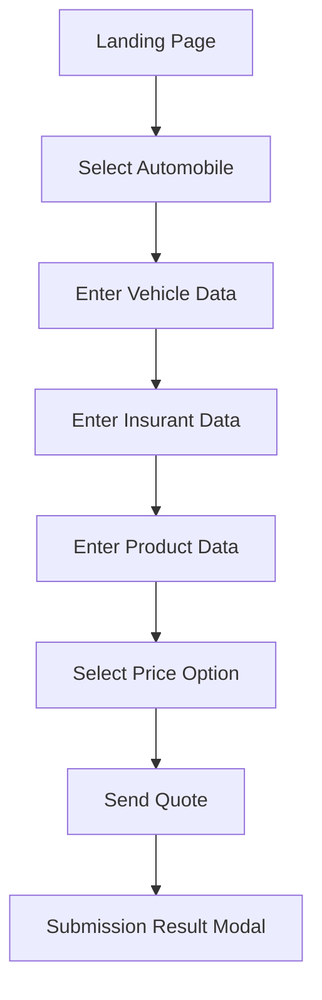

# Automobile Line of Business
## Functional and Business Specification

Version: 1.0
Date: 2026-07-29
Application: Tricentis Vehicle Insurance Sample App (Automobile)
Prepared by: Senior Business Analyst (AI-assisted, validated via Playwright MCP walkthrough)

## 1. Purpose
This document defines the end-to-end business and functional behavior for the Automobile line of business (LOB) in the Tricentis Vehicle Insurance application.

The objective is to provide a complete, practical specification that business, QA, automation, and delivery teams can use as a shared baseline for scope, process, validation, and acceptance.

## 2. Scope
In scope:
- New Automobile quote journey from product selection to quote submission.
- All five wizard stages.
- Input data, option sets, validation posture, price package selection, and submission behavior.

Out of scope:
- Policy issuance and payment processing.
- Back-office underwriting workflows.
- Data persistence model and downstream integrations not exposed in UI.

## 3. Business Context and Goals
Business goals supported by this flow:
- Capture sufficient applicant and vehicle data to produce a quote option.
- Let the user compare preconfigured plan tiers.
- Collect contact and credential information for quote submission.
- Provide immediate submission feedback.

Primary user persona:
- Prospective insurance customer (self-service quote requester).

Secondary personas:
- Business analysts validating requirements.
- QA and automation engineers validating behavior.

## 4. End-to-End Process Overview
1. User enters application landing page.
2. User selects Automobile product.
3. User completes Vehicle Data.
4. User completes Insurant Data.
5. User completes Product Data.
6. User selects one Price Option.
7. User provides Send Quote details and submits.
8. System displays submission modal feedback.

## 5. Wizard Structure and Required-Field Counters
Observed initial counters on a clean Automobile quote:
- Enter Vehicle Data: 7
- Enter Insurant Data: 7
- Enter Product Data: 6
- Select Price Option: 1
- Send Quote: 4

Interpretation:
- Counters represent remaining mandatory validations per step before complete state.
- Counter reaches 0 when required validation is satisfied for that step.

## 6. Functional Requirements by Step

### 6.1 Step 1: Enter Vehicle Data
Objective:
- Capture base automobile and usage details required for quote computation.

Fields and options:
- Make (dropdown): Audi, BMW, Ford, Honda, Mazda, Mercedes Benz, Nissan, Opel, Porsche, Renault, Skoda, Suzuki, Toyota, Volkswagen, Volvo.
- Engine Performance [kW] (text/number-like input).
- Date of Manufacture (date text with calendar picker, MM/DD/YYYY placeholder).
- Number of Seats (dropdown): 1-9.
- Fuel Type (dropdown): Petrol, Diesel, Electric Power, Gas, Other.
- List Price [$] (text/number-like input).
- License Plate Number (text).
- Annual Mileage [mi] (text/number-like input).

User action:
- Next advances only when required validation is satisfied.

### 6.2 Step 2: Enter Insurant Data
Objective:
- Capture customer identity and profile data.

Fields and options:
- First Name (text).
- Last Name (text).
- Date of Birth (date text with calendar picker, MM/DD/YYYY).
- Gender (radio): Male, Female.
- Street Address (text).
- Country (dropdown; full country list).
- Zip Code (text).
- City (text).
- Occupation (dropdown): Employee, Public Official, Farmer, Unemployed, Selfemployed.
- Hobbies (multi-checkbox): Speeding, Bungee Jumping, Cliff Diving, Skydiving, Other.
- Website (text).
- Picture (file selector and path container).

User action:
- Next advances only when required validation is satisfied.

### 6.3 Step 3: Enter Product Data
Objective:
- Capture requested insurance configuration.

Fields and options:
- Start Date (date text with calendar picker, MM/DD/YYYY).
- Insurance Sum [$] (dropdown): 3,000,000 to 35,000,000.
- Merit Rating (dropdown): Super Bonus, Bonus 1-9, Malus 10-17.
- Damage Insurance (dropdown): No Coverage, Partial Coverage, Full Coverage.
- Optional Products (multi-checkbox): Euro Protection, Legal Defense Insurance.
- Courtesy Car (dropdown): No, Yes.

User action:
- Next advances only when required validation is satisfied.

### 6.4 Step 4: Select Price Option
Objective:
- Allow customer to choose one quote plan.

Plan choices (single-select radio):
- Silver
- Gold
- Platinum
- Ultimate

Comparison matrix:
- Price per Year ($): 108.00, 320.00, 629.00, 1,199.00
- Online Claim: No, Submit, Submit, Submit
- Claims Discount (%): No, 2, 5, 10
- Worldwide Cover: No, Limited, Limited, Unlimited

Functional rule:
- Exactly one plan must be selected to continue.

### 6.5 Step 5: Send Quote
Objective:
- Capture contact/account details and trigger quote submission.

Fields:
- E-Mail (email input type).
- Phone (text).
- Username (text).
- Password (password input type).
- Confirm Password (password input type).
- Comments (textarea).

User action:
- Send submits quote request and opens status modal.

## 7. Business Rules
BR-001: Automobile flow is a five-step guided wizard and must be completed in sequence for first-time users.

BR-002: Each step has mandatory field validations represented by counters; completion status is visible to user.

BR-003: Progression control enforces data completeness before moving to next step.

BR-004: Price option selection is mutually exclusive and required.

BR-005: Credential pair in Send Quote requires password and confirm password consistency.

BR-006: Date-driven fields follow MM/DD/YYYY format in UI.

BR-007: Optional products and hobbies permit multiple selections.

## 8. Validation and Error Behavior
Observed behavior:
- UI prevents straightforward progression with missing required inputs.
- Submission produces modal feedback after Send.
- In one observed run, modal content showed mixed feedback text (success heading with invalid note), indicating potential demo-environment inconsistency.

Requirement guidance for team:
- Treat submission modal semantics as a candidate defect if conflicting messages appear.
- Define deterministic expected outcome text in acceptance tests.

## 9. Data Dictionary (Business View)
Vehicle Data domain:
- Vehicle manufacturer, performance, manufacture date, seating, fuel, value, registration identifier, annual usage.

Insurant Data domain:
- Personal identity, demographics, location, occupation, interests, digital profile, optional attachment.

Product Data domain:
- Coverage start, insured amount, risk bonus/malus rating, damage coverage, add-ons, courtesy replacement preference.

Pricing domain:
- Plan tier and associated annual premium/benefits.

Submission domain:
- Contact channel and account credentials for quote communication.

## 10. Non-Functional Expectations
NFR-001: Wizard response on navigation should be near-immediate for user continuity.

NFR-002: Form validation messaging should be clear, deterministic, and non-contradictory.

NFR-003: Data entry controls should remain stable for desktop web viewport used by business users and QA automation.

NFR-004: Price matrix and selected plan state must remain consistent across step navigation.

## 11. Acceptance Criteria (Business + Functional)
AC-001: User can start Automobile quote from landing page in one click path.

AC-002: User cannot complete flow without satisfying required fields in all five steps.

AC-003: User can select one and only one price option.

AC-004: User can submit quote with valid Send Quote data.

AC-005: System displays a clear final status modal after submission.

AC-006: Final status messaging is internally consistent (no conflicting success/invalid in same completion state).

## 12. E2E Example Scenario (Happy Path)
1. Select Automobile.
2. Enter vehicle details and proceed.
3. Enter insurant details and proceed.
4. Enter product details and proceed.
5. Select Gold plan (or any single plan) and proceed.
6. Enter email, phone, username, password, confirm password, comments.
7. Submit quote.
8. Verify final modal outcome.

## 13. Risks and Open Points for Team Discussion
- Submission feedback message consistency should be clarified with product owner.
- Exact field-level validation constraints (for example, min/max lengths and regex) are not explicitly displayed for all fields and should be confirmed from source requirements or backend contract.
- Picture upload business necessity should be clarified (mandatory vs optional by channel).

## 14. Recommended Test Coverage Map
- Positive happy path for each plan tier.
- Negative mandatory-field checks per step.
- Date format and invalid date checks.
- Password mismatch check.
- Email format check.
- Multi-select behavior for hobbies and optional products.
- Modal outcome consistency checks.

## 15. Traceability Reference
This specification is based on direct Playwright MCP walkthrough and live UI metadata capture across all Automobile wizard steps on 2026-07-29.
