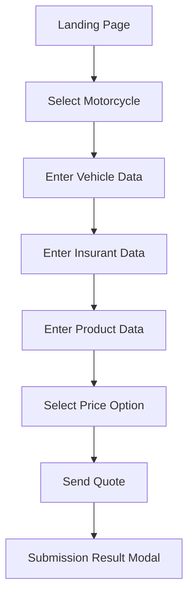

# Motorcycle Line of Business
## Functional and Business Specification

Version: 1.0
Date: 2026-07-30
Application: Tricentis Vehicle Insurance Sample App (Motorcycle)
Prepared by: Senior Business Analyst (AI-assisted, validated via Playwright MCP walkthrough)

## 1. Purpose
This document defines the end-to-end business and functional behavior for the Motorcycle line of business (LOB) in the Tricentis Vehicle Insurance application.

The goal is to provide a shared baseline for business, QA, and automation teams for the motorcycle quote journey.

## 2. Scope
In scope:
- New Motorcycle quote journey from offer selection through quote submission.
- All five wizard stages.
- Vehicle-specific input data, price selection, and submission behavior.

Out of scope:
- Policy issuance and payment processing.
- Back-office underwriting workflows.
- Data persistence and downstream integrations not exposed in the UI.

## 3. Business Context and Goals
Business goals supported by this flow:
- Capture vehicle and applicant information required for motorcycle quote generation.
- Let the user compare preconfigured quote plan tiers.
- Collect contact and credential information for submission.
- Provide immediate feedback after quote submission.

Primary user persona:
- Prospective insurance customer seeking a motorcycle quote.

## 4. End-to-End Process Overview
1. User enters the landing page.
2. User selects the Motorcycle product.
3. User completes Vehicle Data.
4. User completes Insurant Data.
5. User completes Product Data.
6. User selects one Price Option.
7. User submits Send Quote details.
8. System displays a feedback modal.

## 5. Wizard Structure and Required-Field Counters
Observed initial counters on a clean Motorcycle quote:
- Enter Vehicle Data: 8
- Enter Insurant Data: 7
- Enter Product Data: 4
- Select Price Option: 1
- Send Quote: 4

Interpretation:
- Counters represent remaining mandatory validations before completion.
- A counter reaches 0 when the required validation is satisfied for that step.

## 6. Functional Requirements by Step

### 6.1 Step 1: Enter Vehicle Data
Objective:
- Capture motorcycle-specific vehicle and usage details required for quote computation.

Fields and options:
- Make (dropdown): Audi, BMW, Ford, Honda, Mazda, Mercedes Benz, Nissan, Opel, Porsche, Renault, Skoda, Suzuki, Toyota, Volkswagen, Volvo.
- Model (dropdown): Scooter, Three-Wheeler, Moped, Motorcycle.
- Cylinder Capacity [ccm] (text/number-like input).
- Engine Performance [kW] (text/number-like input).
- Date of Manufacture (date text with MM/DD/YYYY placeholder).
- Number of Seats (dropdown): 1, 2, 3.
- List Price [$] (text/number-like input).
- Annual Mileage [mi] (text/number-like input).

User action:
- Next advances only when required validation is satisfied.

### 6.2 Step 2: Enter Insurant Data
Objective:
- Capture personal and profile data for the applicant.

Fields and options:
- First Name (text).
- Last Name (text).
- Date of Birth (date text with MM/DD/YYYY).
- Gender (radio): Male, Female.
- Street Address (text).
- Country (dropdown).
- Zip Code (text).
- City (text).
- Occupation (dropdown).
- Website (text).

User action:
- Next advances only when required validation is satisfied.

### 6.3 Step 3: Enter Product Data
Objective:
- Capture requested coverage and policy configuration.

Fields and options:
- Start Date (date text with MM/DD/YYYY).
- Insurance Sum [$] (dropdown).
- Merit Rating (dropdown).
- Damage Insurance (dropdown).
- Optional Products (checkboxes such as Euro Protection and Legal Defense Insurance).
- Courtesy Car (dropdown: No/Yes).

User action:
- Next advances only when required validation is satisfied.

### 6.4 Step 4: Select Price Option
Objective:
- Allow customer to choose one quote plan.

Plan choices (single-select radio):
- Silver
- Gold
- Platinum
- Ultimate

Functional rule:
- Exactly one plan must be selected to continue.

### 6.5 Step 5: Send Quote
Objective:
- Capture contact/account details and trigger quote submission.

Fields:
- E-Mail (email input).
- Phone (text).
- Username (text).
- Password (password input).
- Confirm Password (password input).
- Comments (textarea).

User action:
- Send submits quote request and opens the final status modal.

## 7. Business Rules
BR-001: Motorcycle flow is a five-step guided wizard and must be completed in sequence.

BR-002: Each step has mandatory field validations represented by counters.

BR-003: Progression control enforces data completeness before moving to the next step.

BR-004: Price option selection is mutually exclusive and required.

BR-005: The password pair in Send Quote must be consistent.

BR-006: Date-driven fields follow MM/DD/YYYY format in the UI.

## 8. Validation and Error Behavior
Observed behavior:
- The UI prevents straightforward progression with missing required inputs.
- Submission produces a feedback modal after Send.
- The final modal content should be treated as a candidate defect if success and invalid messages appear together.

## 9. Acceptance Criteria
AC-001: User can start a Motorcycle quote from the landing page in one click.

AC-002: User cannot complete the flow without satisfying required fields in all five steps.

AC-003: User can select one and only one price option.

AC-004: User can submit a quote with valid Send Quote data.

AC-005: System displays a clear final status modal after submission.

## 10. E2E Example Scenario (Happy Path)
1. Select Motorcycle.
2. Enter vehicle details and proceed.
3. Enter insurant details and proceed.
4. Enter product details and proceed.
5. Select Gold plan and proceed.
6. Enter user credentials and comments.
7. Submit the quote.
8. Verify the final modal outcome.

## 11. Risks and Open Points
- Final submission message semantics should be aligned with the product owner.
- Exact field-level validation constraints should be confirmed from product or backend contract.
- Some optional fields may need clarification on mandatory behavior by channel.
