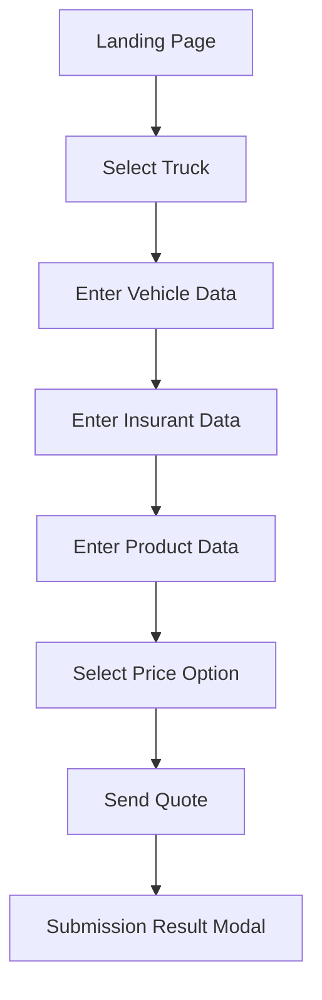

# Truck Line of Business
## Functional and Business Specification

Version: 1.0
Date: 2026-07-29
Application: Tricentis Vehicle Insurance Sample App (Truck)
Prepared by: Senior Business Analyst (AI-assisted, validated via Playwright MCP walkthrough)

## 1. Purpose
This document defines the end-to-end business and functional behavior for the Truck line of business (LOB) in the Tricentis Vehicle Insurance application.

## 2. Scope
In scope:
- New Truck quote journey from product selection to quote submission.
- Five-step wizard behavior and progression controls.
- Field-level options, observed validations, price comparison, and quote submission flow.

Out of scope:
- Policy issuance, payment, and downstream policy lifecycle.
- Back-office processing not exposed in UI.

## 3. Business Goals
- Capture truck-specific vehicle and applicant data required for quoting.
- Present clear plan comparison and enforce a single plan selection.
- Capture contact and credential data before quote submission.

## 4. End-to-End Process Overview
1. User opens landing page.
2. User selects Truck offer.
3. User completes Enter Vehicle Data.
4. User completes Enter Insurant Data.
5. User completes Enter Product Data.
6. User selects one Price Option.
7. User completes Send Quote form and submits.
8. System displays final submission modal.

## 5. Wizard Counters and Progress Controls
Observed initial required counters for Truck:
- Enter Vehicle Data: 9
- Enter Insurant Data: 7
- Enter Product Data: 4
- Select Price Option: 1
- Send Quote: 4

Interpretation:
- Counters represent remaining mandatory validations by step.
- Step transitions are blocked until required validations are satisfied.

Additional gating behavior observed:
- Price table does not render until first three steps are complete.
- Send Quote form does not render unless a price option is selected.

## 6. Functional Requirements by Step

### 6.1 Step 1: Enter Vehicle Data (Truck)
Objective:
- Capture truck-specific risk and value attributes.

Fields and options:
- Make (dropdown): Audi, BMW, Ford, Honda, Mazda, Mercedes Benz, Nissan, Opel, Porsche, Renault, Skoda, Suzuki, Toyota, Volkswagen, Volvo.
- Engine Performance [kW] (numeric text input).
- Date of Manufacture (MM/DD/YYYY with date picker).
- Number of Seats (dropdown 1-9).
- Fuel Type (dropdown): Petrol, Diesel, Electric Power, Gas, Other.
- Payload [kg] (numeric text input).
- Total Weight [kg] (numeric text input).
- List Price [$] (numeric text input).
- License Plate Number (text).
- Annual Mileage [mi] (numeric text input).

Observed validation hints:
- Engine Performance: 1 to 2000.
- Payload: 1 to 1000.
- Total Weight: 500 to 100000.
- List Price: 500 to 100000.
- Annual Mileage: 100 to 100000.
- License Plate Number: under 10 characters.

### 6.2 Step 2: Enter Insurant Data
Objective:
- Capture applicant personal and profile information.

Fields:
- First Name, Last Name, Date of Birth, Gender.
- Street Address, Country, Zip Code, City.
- Occupation.
- Hobbies (multi-select checkboxes).
- Website.
- Picture upload control.

Observed validation hints:
- First/Last Name: at least 2 letters.
- Date of Birth: user age between 18 and 70.
- Zip Code: numeric, 4 to 8 digits.
- Website: valid URL format.
- Hobbies: at least one option selected.

### 6.3 Step 3: Enter Product Data (Truck)
Objective:
- Capture requested truck insurance coverage preferences.

Fields and options:
- Start Date (MM/DD/YYYY).
- Insurance Sum [$]: 3.000.000,00 to 35.000.000,00.
- Damage Insurance: No Coverage, Partial Coverage, Full Coverage.
- Optional Products: Euro Protection, Legal Defense Insurance.

Observed validation hint:
- Start Date must be more than one month in the future.

### 6.4 Step 4: Select Price Option
Objective:
- Present quote packages and capture one selection.

Plan options:
- Silver
- Gold
- Platinum
- Ultimate

Truck price matrix observed:
- Price per Year ($): 279.00, 823.00, 1,615.00, 3,078.00
- Online Claim: No, Submit, Submit, Submit
- Claims Discount (%): No, 2, 5, 10
- Worldwide Cover: No, Limited, Limited, Unlimited

Functional rule:
- Exactly one plan must be selected before moving to Send Quote.

### 6.5 Step 5: Send Quote
Objective:
- Capture contact and credential details and submit quote request.

Fields:
- E-Mail
- Phone
- Username
- Password
- Confirm Password
- Comments

Functional rule:
- Form is available only after a valid price option selection.

## 7. Business Rules
BR-TRK-001: Truck quote flow is a guided five-step wizard.

BR-TRK-002: Mandatory fields are enforced by step counters and validation messages.

BR-TRK-003: User cannot access price comparison until Vehicle, Insurant, and Product steps are complete.

BR-TRK-004: User cannot submit quote without selecting exactly one price option.

BR-TRK-005: Password and Confirm Password must match.

BR-TRK-006: Date inputs use MM/DD/YYYY format.

BR-TRK-007: Optional products and hobbies support multi-select behavior.

## 8. Validation and Error Behavior
Observed behavior:
- Step progression is blocked on mandatory/format/range validation failures.
- Informational text appears when prerequisite steps are incomplete.
- Informational text appears when trying to reach Send Quote without plan selection.
- Successful step completion reduces step counters to 0.

## 9. Acceptance Criteria (High-Level)
AC-TRK-001: User can start Truck quote from landing page.

AC-TRK-002: User can complete Vehicle Data with valid truck-specific values.

AC-TRK-003: User can complete Insurant and Product steps with valid inputs.

AC-TRK-004: User can view and choose one Truck price plan.

AC-TRK-005: User can submit quote from Send Quote with valid data and receive result modal.

## 10. Risks and Clarifications
- Exact validation limits should be confirmed with source requirements/backend contracts.
- Submission modal content consistency should be confirmed for deterministic test assertions.
- Picture upload mandatory status should be clarified by business channel.

## 11. Traceability Reference
This specification is based on direct Playwright MCP walkthrough and live Truck UI metadata capture on 2026-07-29.
